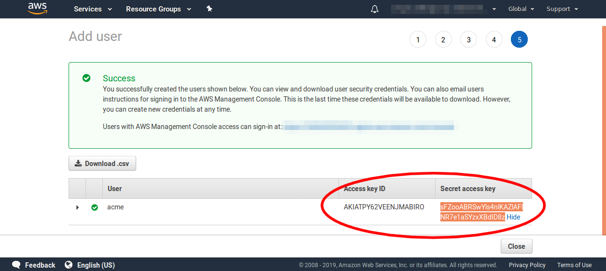

### Let's Encrypt

Let's Encrypt is a non-profit certificate authority that can issue you SSL certificates for free. These certificates can be used to secure any type of TLS connection. Most commonly they are used to secure HTTPS web sites, but they can also be used to secure email, usenet news, file servers, chat servers or any other type of internet connection.

SSL Certificates come with three types of validation: Domain, Organization and Extended. Let's Encrypt only offers Domain Validation Certificates, but these certificates are all you need to enable high strength encryption on these connections and to allow clients to know that they are connecting to the correct domain, thus thwarting Man-in-the-middle attacks. In order to validate that you do indeed own your domain, Let's Encrypt uses a completely automatic process implemented via a protocol called ACME.

### ACME Protocol


AMCE is a basic challenge/response system. You send a request for your domain to the ACME service running on Let's Encrypt's servers and it gives you a token. Then the servers look for that token via in that domain via some method and will issue you a certificate if the token is found. You can then use that certificate.

These certificates are only valid for **three months** and so you will need some automatic method to renegotiate a new certificate as the old one gets close to expiry.

After trying many different tools to perform the ACME negotiation I have found that the best tool for the job is [acmetool](https://github.com/hlandau/acme). Even before it was easily installable as a package and bundled in the main linux distributions it was well worth manually compiling it. _acmetool_ gives a better experience than the other clients and I have found it to be rock solid and reliable.

### Problems with Web Server Based Verification

Now, there are a number of ways to place that ACME token for the Let's Encrypt servers to verify. Commonly they are placed on your local webserver itself in a pre-decided directory. This is easy, but suffers from some fairly singificant problems:

* **A webserver needs to be running.** If a webserver is not running for any reason then the certificates cannot be gathered or renewed. Some ACME software includes a bundled webserver that can be started as needed for this purpose. But this is still not ideal, as you end up with two sets of ACME configurations. One for servers running a webserver. And one for servers that aren't.

* **The webserver must (at least) serve the directory over http.** This complicates any http to https redirection rules you have setup in your webserver configuration.

* In an idempotent provisioning environment **the webserver will initially need to be started without a certificate present at all** leading to a chicken and egg orchestration problem. On a server like nginx, if an SSL certificate is mentioned in the configutation but is not found on the filesystem, the server refuses to start. Thus you need either two seperate configurations, one without a certificate (before the first certificate is issued) and one with the Let's Encrypt certificate. Or you need a dummy, self-signed certificate just to prevent nginx from blowing up before the Let's Encrypt certificate is ready.

* **The webserver needs to be running on a live IP, on a standard port and accessible from the Internet.** The Let's Enrypt servers need to be able to reach your webserver. This means that you cannot use this method for any servers behind a corporate firewall or running on a non standard port.

### Advantages of DNS Based Verification

An alternative way to verify the Let's Encrypt challenge token is to serve it to the Internet in a DNS record. Although a little more intricate in its setup, I have found through experience that this method has many distinct advantages and **is the method I personally recommend to my clients**. Some of it's advantages are:

* **Can be used in exactly the same way on all servers, with or without a webserver present.** This greatly simplifies orchestration code and the amount of information an engineer needs to load into their brain before working on the system or troubleshooting issues.

* **It is *out-of-band* of any other service and will continue to operate even if the other service has problems.** If nginx experiences trouble, or something else binds to port 80 (in the self contained webserver example), or a firewall rule is changed blocking access, the certificate process will be unaffected.

* **Can generate certificates on machines on private IPs and behind corporate firewalls.** DNS verification allows you to secure *all* your services with TLS including all your intranet and VPC services. This helps prevent the soft underbelly syndrome. Data is better protected even when it is travelling on the internal private company networks.

Now lets get started...

### Install acmetool and packages

If you are using Ubuntu 18.04 or above, then `acmetool` is already included in the system packages. Install this and we will also need `python3` and `python3-boto3` for our DNS hook script:

```language-shell-session
$ apt-get install acmetool python3 python3-boto3
```

### Configuring acmetool

Make a folder to store the custom DNS hook script in. *Make sure this is outside of the acmetool state directory*.

```language-shell-session
$ mkdir -p /usr/lib/acme/hooks
```

Setup the `acme-conf.yml` file to look like the following. This file is found at `/var/lib/acme/conf/responses/acme-conf.yml`

##### /var/lib/acme/conf/responses/acme-conf.yml

```language-yaml
# This is a example of a response file, used with --response-file.
# It automatically answers prompts for unattended operation.
# grep for UniqueID in the source code for prompt names.
#  https://github.com/hlandau/acme/search?q=UniqueID
# Pass --response-file to all invocations, not just quickstart.
# If you don't pass --response-file, it will be looked for at "(state-dir)/conf/responses".
# You will typically want to use --response-file with --stdio or --batch.
# For dialogs not requiring a response, but merely acknowledgement, specify true.
# This file is YAML. Note that JSON is a subset of YAML.
"acme-enter-email": "youremail@yourdomain.com"
"acme-agreement:https://letsencrypt.org/documents/LE-SA-v1.2-November-15-2017.pdf": true
#"acmetool-quickstart-choose-server": https://acme-staging.api.letsencrypt.org/directory
"acmetool-quickstart-choose-server": https://acme-v01.api.letsencrypt.org/directory
"acmetool-quickstart-choose-method": hooks
# This is only used if "acmetool-quickstart-choose-method" is "webroot".
"acmetool-quickstart-webroot-path": "/var/run/acme/acme-challenge"
"acmetool-quickstart-complete": true
"acmetool-quickstart-install-cronjob": true
"acmetool-quickstart-install-haproxy-script": false
"acmetool-quickstart-install-redirector-systemd": false
"acmetool-quickstart-key-type": rsa
"acmetool-quickstart-rsa-key-size": 4096
"acmetool-quickstart-ecdsa-curve": nistp256
```

Setup the `target` file to look like the following. This file is found at `/var/lib/acme/conf/target`

##### /var/lib/acme/conf/target

```language-yaml
request:
  provider: https://acme-v01.api.letsencrypt.org/directory
  key:
    type: rsa
```

Now we are ready to install the main Route53 DNS hook script.

##### /usr/lib/acme/hooks/route53

```language-python
#!/usr/bin/env python3
"""
Based on from: https://gist.github.com/ramirovjr/181979298149c5e74887f30fe09dcc71
modified to support acmetool by crispin@epiccastle.io
requires environment variable ACME_HOSTED_ZONE to contain route53 Zone ID
"""
import os
import sys
import boto3
from time import sleep

def setup_dns(domain, txt_challenge, hosted_zone_id):
    session = boto3.Session()
    client = session.client("route53")

    resp = client.change_resource_record_sets(
        HostedZoneId=hosted_zone_id,
        ChangeBatch={
            'Changes': [{
                'Action': 'UPSERT',
                'ResourceRecordSet': {
                    'Name': '_acme-challenge.{0}'.format(domain),
                    'Type': 'TXT',
                    'TTL': 60,
                    'ResourceRecords': [{
                        'Value': '"{0}"'.format(txt_challenge)}]}}]})

    # wait 30 seconds for DNS update
    sleep(30)

def delete_dns(domain, txt_challenge, hosted_zone_id):
    session = boto3.Session()
    client = session.client("route53")

    resp = client.change_resource_record_sets(
        HostedZoneId=hosted_zone_id,
        ChangeBatch={
            'Changes': [{
                'Action': 'DELETE',
                'ResourceRecordSet': {
                    'Name': '_acme-challenge.{0}'.format(domain),
                    'Type': 'TXT',
                    'TTL': 60,
                    'ResourceRecords': [{
                        'Value': '"{0}"'.format(txt_challenge)}]}}]})

if __name__ == "__main__":
    assert len(sys.argv) > 3, "not enough command line arguments passed in"

    hook = sys.argv[1]
    domain = sys.argv[2]
    txt_challenge = sys.argv[4]

    if 'ACME_HOSTED_ZONE' not in os.environ:
        raise Exception("Environment variable ACME_HOSTED_ZONE not defined")

    hosted_zone_id = os.environ['ACME_HOSTED_ZONE']

    if hook == "challenge-dns-start":
        setup_dns(domain, txt_challenge, hosted_zone_id)
    elif hook == "challenge-dns-stop":
        delete_dns(domain, txt_challenge, hosted_zone_id)
```
Now, in order to run this script needs the following environment variables set:

* **ACME\_HOOKS\_DIR** The location of our hooks directory `/usr/lib/acme/hooks/`
* **ACME\_HOSTED\_ZONE** The Route53 Zone ID of the domain hosting the DNS records
* **AWS\_ACCESS\_KEY\_ID** An AWS IAM access key ID that will be used to alter the DNS records
* **AWS\_SECRET\_ACCESS\_KEY** The IAM secret key for that identity.

Finally run the quickstart acmetool command in batch mode to initialise the acmetool state directory:

```language-shell-session
$ acmetool --batch quickstart
```

Now that is all setup, let's go through setting up the IAM identity in AWS and finding out our Zone ID

### Setting up an IAM identity to alter Route53 records


Login to your AWS web console, and navigate to the IAM dashboard. Click on `Users` and then click on the `Add user` button:

___


On the next screen enter a name for the identity. Here I have entered `acme` but any name will do so long as it is valid and not already used. Under Access type select the checkbox next to **Programmatic access**. Then click the `Next` button.

___


On the second screen click on **Attach existing policies directly**. Then in the Filter policies search box enter `Route53DomainsFull` to filter the policy list down to find the correct policy. Then mark the checkbox near the **AmazonRoute53DomainsFullAccess** policy and click the **Next** button.

___


Adding a tag is optional but it can help others discover what the IAM identity is used for, so here I have added a tag `description` with a value of `used by acmetool to set lets encrypt challenge string in Route53 DNS records`. Click **Next** to move on.

___


Review the user's details. They should look like the following. If everything is correct click the **Create user** button.

___


The final screen will give you the new user's access key ID and secret. But to show the secret you will need to click the **Show** link. So go ahead and do that now.
___



This is the only time the key ID and the secret key will be available to you. So you need to save both these values now for later. You can place them into your ansible vault, hashicorp vault, chef databag, or whatever devops secret encryption storage you are using.

**Note:** I left the key ID and secret unblurred in these screenshots so you can see what form they have so as to reduce any confusion. But these are not actually valid IAM access credentials that you can use to hack my account! I am not that silly!

### Finding your Route53 domain Zone ID


Navigate to the Route53 dashboard webpage. Click **Hosted zones** on the left panel or the central dashboard area.
___


On the hosted zones page you will see a list of the Hosted Zone IDs down the right hand side. There is one Zone ID for each Zone. Each Zone ID begins with the letter Z and is 13 or 14 characters long. You will need to record the Zone ID for the zone that your Let's Encrypt certificate's domain will be in.


### Setup Cron Running Of acmetool Renewal

`acmetool` will need to be run regularly in order to update any certificates that are coming up for renewal. Let's Encrypt currently issues 90 day certificates. acmetool will try to renew certificates automatically once they are 30 days from expiry, or two thirds through their validity period. Put the following in `/etc/cron.d/acmetool`:

##### /usr/lib/acme/hooks/route53

```language-shell
SHELL=/bin/sh
PATH=/bin:/sbin:/usr/bin:/usr/sbin:/usr/local/bin:/usr/local/sbin
MAILTO=root
ACME_HOOKS_DIR="/usr/lib/acme/hooks/"
ACME_HOSTED_ZONE="<< zone id here >>"
AWS_ACCESS_KEY_ID="<< aws access key id here >>"
AWS_SECRET_ACCESS_KEY="<< aws secret access key here >>"
23 0 * * * root /usr/bin/acmetool --batch reconcile
```

Replace the values inside the double angled brackets with your values

**Note:** acmetool will exit with an error message with nonzero exit status if it cannot renew a certificate. Ensure your system is configured so that you get notifications of failing cronjobs.

### Gather the certificates

Now we are ready to gather the certificates we need. Export the environment variables into the shell, and then run `acmetool want` to gather the certificates. Replace my.domain.com with the fully qualified domain name you want the certificate for.

```language-shell-session
$ export ACME_HOOKS_DIR="/usr/lib/acme/hooks/"
$ export ACME_HOSTED_ZONE="<< zone id here >>"
$ export AWS_ACCESS_KEY_ID="<< aws access key id here >>"
$ export AWS_SECRET_ACCESS_KEY="<< aws secret access key here >>"
$ acmetool --batch want my.domain.com
```

Now, if nothing went wrong, you should find your certificate(s) and private key at `/var/lib/acme/live/domain.name`

```language-shell-session
$ ls /var/lib/acme/live/my.domain.com/
cert  chain  fullchain  privkey  url
```

### Troubleshooting

If something fails, even inside the cron job, you can examine what last went wrong with additional information with the following:

```language-shell-session
$ acmetool --xlog.severity=debug
```

This will show you all the steps that acmetool took to try to verify your domain and the results of those steps.

### Example Setup For Nginx

Here is a quick example section from an nginx sites-enabled config file showing the use of that certificate. Use this as a reference for ither servers or applications.

```language-nginx
# HTTP Server
server {
    listen 80;
    server_name  my.domain.com;

    # redirect http traffic to https
    location / {
      return 301 https://$host$request_uri;
    }
}

# HTTPS Server
server {
   listen 443 ssl;
   server_name my.domain.com;

   # our lets encrypt certificate chain and private key
   ssl_certificate      /var/lib/acme/live/my.domain.com/fullchain;
   ssl_certificate_key  /var/lib/acme/live/my.domain.com/privkey;

   ssl_session_cache    shared:SSL:1m;
   ssl_session_timeout  5m;

   # disable weak and vulnerable ciphers
   ssl_ciphers "ECDHE-RSA-AES128-GCM-SHA256:ECDHE-ECDSA-AES128-GCM-SHA256:ECDHE-RSA-AES256-GCM-SHA384:ECDHE-ECDSA-AES256-GCM-SHA384:DHE-RSA-AES128-GCM-SHA256:DHE-DSS-AES128-GCM-SHA256:kEDH+AESGCM:ECDHE-RSA-AES128-SHA256:ECDHE-ECDSA-AES128-SHA256:ECDHE-RSA-AES128-SHA:ECDHE-ECDSA-AES128-SHA:ECDHE-RSA-AES256-SHA384:ECDHE-ECDSA-AES256-SHA384:ECDHE-RSA-AES256-SHA:ECDHE-ECDSA-AES256-SHA:DHE-RSA-AES128-SHA256:DHE-RSA-AES128-SHA:DHE-DSS-AES128-SHA256:DHE-RSA-AES256-SHA256:DHE-DSS-AES256-SHA:DHE-RSA-AES256-SHA:ECDHE-RSA-DES-CBC3-SHA:ECDHE-ECDSA-DES-CBC3-SHA:AES128-GCM-SHA256:AES256-GCM-SHA384:AES128-SHA256:AES256-SHA256:AES128-SHA:AES256-SHA:AES:CAMELLIA:DES-CBC3-SHA:!aNULL:!eNULL:!EXPORT:!DES:!RC4:!MD5:!PSK:!aECDH:!EDH-DSS-DES-CBC3-SHA:!EDH-RSA-DES-CBC3-SHA:!KRB5-DES";
   ssl_prefer_server_ciphers  on;

   # you may want some custome diffie hellman parameters to be extra secure
   ssl_dhparam /etc/nginx/dhparams.pem;

   # logging
   access_log /var/log/nginx/my.domain.com_access.log main;
   error_log /var/log/nginx/my.domain.com_error.log;

   # our documents location
   root /var/www/my.domain.com/public;
}
```


This should get you up and running with Route53 and acmetool. I hope you had success!
